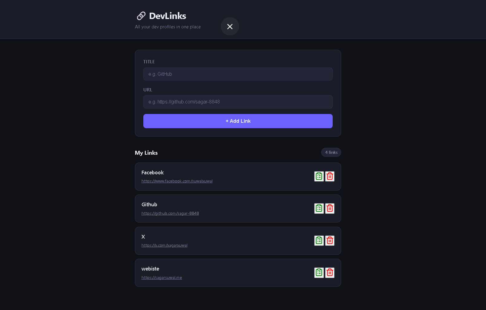

# 01 — DevLinks 🔗

> A personal developer link manager — add, copy and delete
> all your dev profile links in one clean place.
> Built with vanilla HTML, CSS and JavaScript. No frameworks.

## 🎯 What I Built

A clean link management tool where developers can store all
their profile links (GitHub, LinkedIn, Portfolio etc) in one
place. Links persist via localStorage so they survive page
refresh. Users can copy any link to clipboard with one click.

## ✨ Features

- [x] Add new link with title + URL
- [x] Auto adds https:// if missing from URL
- [x] Validates URL format before saving
- [x] Copy link to clipboard with one click
- [x] Delete any link instantly
- [x] Live link counter (X links)
- [x] Empty state when no links exist
- [x] Toast notifications for all actions
- [x] Persists on page refresh via localStorage
- [x] Clickable URL opens in new tab
- [x] Smooth card slide-in animation on add

## 🧠 JS Concepts Used

- DOM manipulation — createElement, classList, innerHTML
- Event handling — submit, click events
- localStorage — setItem, getItem, JSON.stringify, JSON.parse
- Clipboard API — navigator.clipboard.writeText()
- URL validation — URL constructor inside try/catch
- Array methods — forEach, splice, some
- Form handling — preventDefault, reset
- Template literals — dynamic HTML content

## 📝 Honest Notes

Builder Pattern and Observer Pattern were originally planned
but kept out intentionally — DevLinks is a DOM + Storage
focused project and adding those patterns here would feel
forced. Both patterns are properly applied in the next
project → ExpenseIQ where they fit naturally.

## 🐛 Known Fixes Applied

- Added await to clipboard API (async operation)
- Empty field check moved before URL manipulation
- Duplicate URL detection added
- URL auto-prefixed with https:// if missing

## 🚀 How to Run

1. Clone the repo
2. Open index.html in browser
3. No build step — pure HTML CSS JS

## 📸 Screenshot

## 🔗 Live Demo

[View Live](#) ← deploy to GitHub Pages

## 📁 File Structure

\`\`\`
01-devlinks/
  ├── index.html   → structure + markup
  ├── style.css    → dark theme + animations
  ├── app.js       → all JS logic
  └── README.md    → this file
\`\`\`

## 💡 What I Learned

- localStorage only stores strings — always
  JSON.stringify on write, JSON.parse on read
- Clipboard API is async — always use await
  and wrap in try/catch for permission errors
- URL constructor throws on invalid URLs —
  perfect for validation without regex
- Always validate empty fields BEFORE
  manipulating or transforming values
- innerHTML = "" to clear container before
  re-rendering prevents duplicate cards
- splice() removes items by index but filter()
  by ID is safer for dynamic lists

## 👨‍💻 Author

**Sagar Suwal**
- GitHub: [@sagar-8848](https://github.com/sagar-8848)
- BSc IT — Himalayan College of Management, Nepal
- Path: Vanilla JS → React → MERN → GenAI