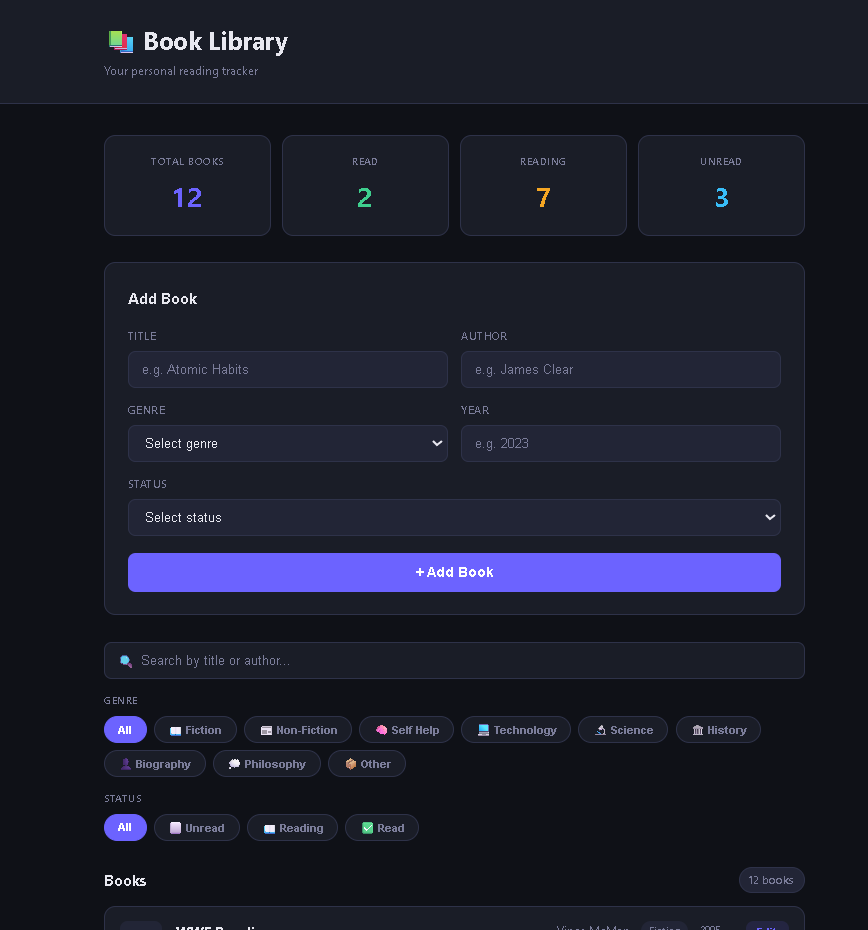

# 03 — Book Library 📚

> A personal reading tracker built with vanilla JavaScript.
> Add, edit, delete and filter your books by genre and status.
> Built with proper OOP architecture and design patterns.
> No frameworks. Pure JS.

## 🎯 What I Built

A full book management system where you can track your
reading list with title, author, genre, year and reading
status. Stats update live, filters chain together, and
everything persists on refresh. Includes full edit mode
with cancel support and delete confirmation.

## ✨ Features

- [x] Add book — title, author, genre, year, status
- [x] Edit book — pre-fills form, updates in place
- [x] Delete book — with confirmation dialog
- [x] Live stats — total, read, reading, unread
- [x] Filter by genre — tab system with active state
- [x] Filter by status — tab system with active state
- [x] Both filters work simultaneously
- [x] Search by title OR author — debounced 300ms
- [x] Dynamic filter tabs — smart data-key detection
- [x] Toast notifications — success and error states
- [x] Toast timer resets on rapid actions
- [x] Persists on refresh via localStorage
- [x] Rebuilds Book instances from plain objects on load
- [x] Smooth card animation on add
- [x] Responsive — works on all screen sizes
- [x] Empty state when no books match filters

## 🧠 JS Concepts Used

### OOP & Classes
- **Book base class** — getGenreIcon(), getStatusClass(),
  getFormattedYear() methods
- **Inheritance** — FictionBook and NonFiction extend Book
  with hardcoded genre and overridden getGenreIcon()
- **Custom Errors** — ValidationError (field + statusCode 400)
  and DuplicateBookError (auto message + statusCode 409)
- **Method overriding** — subclasses override parent methods

### State Management
- **Single state object** — books, filters, editingBookId
  all in one place — single source of truth
- **Edit mode flag** — editingBookId tracks whether
  form is in add or edit mode

### Patterns & Techniques
- **Event delegation** — one listener on bookContainer
  handles all delete and edit clicks
- **Dynamic filter detection** — reads data-key from
  clicked tab automatically — works for any filter type
- **Debounce** — implemented from scratch on search input
- **localStorage** — full persistence with instance
  rebuilding on load

### Array Methods
- filter, find, forEach, some — used throughout
- Chained filter conditions in getFilteredBooks()

## 🏗️ Architecture

\`\`\`
app.js
│
├── DOM References (const — never reassigned)
├── Utility (debounce)
├── Custom Errors (ValidationError, DuplicateBookError)
├── Data Maps (categoryIcons, currentStatus)
├── Book Class + FictionBook + NonFiction
├── State Object (books, filters, editingBookId)
├── Storage (saveToStorage, loadFromStorage)
│
├── Core Functions
│   ├── getFilteredBooks()   ← chains all 3 filters
│   ├── renderBooks()        ← renders filtered list
│   └── updateStats()        ← updates 4 stat cards
│
├── Event Listeners
│   ├── form submit          ← add OR edit based on state
│   ├── bookContainer click  ← delete + edit delegation
│   ├── searchFilter input   ← debounced search
│   ├── cancelBtn click      ← resets form mode
│   └── filterSection click  ← genre + status tabs
│
├── Helpers
│   ├── showToast()          ← with timer reset
│   ├── handleEdit()         ← pre-fills form
│   ├── resetFormMode()      ← clears edit state
│   └── setupFilterTabs()    ← wires filter tabs
│
└── init()                   ← load → stats → render
\`\`\`

## 🔄 Data Flow

\`\`\`
User submits form
      ↓
try/catch wraps all validation
      ↓
ValidationError → show in errMsg
DuplicateBookError → show in errMsg
      ↓
editingBookId === null?
  YES → create new Book → push to state.books
  NO  → find book by id → update fields in place
      ↓
saveToStorage() → updateStats() → renderBooks()
\`\`\`

## 💡 What I Learned

- Inheritance with `extends` + `super()` lets subclasses
  hardcode values — FictionBook always has genre "Fiction"
  without user input
- Method overriding — subclass getGenreIcon() runs instead
  of parent's — polymorphism in practice
- Edit mode using a state flag (editingBookId) is cleaner
  than toggling HTML — one form handles both add and edit
- Event delegation on a container handles dynamic buttons —
  no need to re-attach listeners after re-render
- Dynamic data-key detection on filter tabs means one
  listener handles both genre AND status tabs
- localStorage stores plain objects — need to rebuild
  class instances manually on load to get methods back
- Debounce prevents excessive filtering on every keystroke
- Toast timer clearTimeout prevents ghost toasts on
  rapid actions

## 🐛 Things Fixed During Review

- Validation wrapped in try/catch — was crashing page
- Duplicate check uses forEach + throw — catches before add
- Toast clears previous timer on rapid triggers
- Filter tabs use dynamic key detection — not hardcoded
- Delete rebuilds filtered list — respects current filters
- loadFromStorage rebuilds Book instances — not plain objects
- const for all DOM refs — never reassigned

## 🚀 How to Run

1. Clone the repo
2. Open index.html in browser
3. No build step — pure HTML CSS JS

## 📸 Screenshot

## 🔗 Live Demo

[View Live](https://sagar-8848.github.io/javascript-projects/tier-1-foundations/02-book-library/index.html) ← deploy to GitHub Pages

## 📁 File Structure

\`\`\`
03-book-library/
  ├── index.html   → structure + markup
  ├── style.css    → dark theme + responsive
  ├── app.js       → all JS logic
  └── README.md    → this file
\`\`\`

## 👨‍💻 Author

**Sagar Suwal**
- GitHub: [@sagar-8848](https://github.com/sagar-8848)
- BSc IT — Himalayan College of Management, Nepal
- Path: Vanilla JS → React → MERN → GenAI