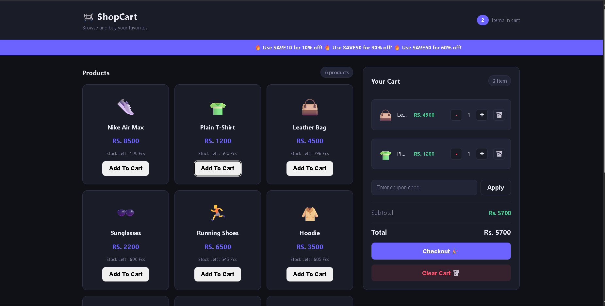

# 04 — ShopCart 🛒

> A full-featured shopping cart built with vanilla JavaScript.
> Browse products, manage your cart, apply coupons and checkout.
> Built with proper OOP, Observer Pattern and state management.
> No frameworks. Pure JS.

## 🎯 What I Built

A complete e-commerce cart experience — browse 10 products,
add them to cart, control quantities, apply discount coupons
with expiry dates, checkout with a receipt modal, and stock
deducts on purchase. Everything persists across page refresh.
A live marquee banner shows only valid (non-expired) coupons.

## ✨ Features

- [x] Browse 10 products with emoji, name, price, stock
- [x] Add to cart — duplicate and out-of-stock checks
- [x] Increase / decrease quantity — capped by stock
- [x] Remove individual item from cart
- [x] Clear entire cart
- [x] Live cart badge — total quantity across all items
- [x] Coupon system with expiry dates
- [x] Only valid coupons shown in marquee banner
- [x] Expired coupons rejected with error toast
- [x] Discount row shown/hidden based on coupon
- [x] Stock deducts on checkout — persists after refresh
- [x] Receipt modal on checkout with full breakdown
- [x] Toast notifications for all actions
- [x] Out of Stock button — disabled when stock = 0
- [x] Full persistence — cart + products via localStorage
- [x] Cart rebuilt as class instances on load (not plain objects)
- [x] Responsive — two column layout stacks on mobile

## 🧠 JS Concepts Used

### OOP & Classes
- **Product** — name, price, stock, emoji, unique UUID
- **CartItem** — product reference + quantity
- **Cart** — all cart operations as class methods
- **Coupon** — isExpired(), isValid(), calculateDiscount()
- **Custom Errors** — DuplicateError, OutOfStockError,
  InvalidCouponError each extend Error

### Design Patterns
- **Observer Pattern** — TrackChanges class with
  subscribe/notify/unSubscribe — cart changes trigger
  updateCart() and saveCart() automatically
- **State management** — single state object holds
  cart instance and active coupon

### Core JS
- **Array methods** — find, filter, reduce, some, forEach
- **localStorage** — full persistence with JSON
- **Instance rebuilding** — CartItem instances rebuilt
  from plain JSON objects on load using products.find()
- **crypto.randomUUID()** — unique product IDs
- **Date comparison** — coupon expiry validation

## 🏗️ Architecture

\`\`\`
app.js
│
├── DOM References
├── Custom Errors
│   ├── DuplicateError
│   ├── OutOfStockError
│   └── InvalidCouponError
│
├── Classes
│   ├── Product
│   ├── CartItem
│   ├── Cart (addToCart, increaseQty, decreaseQty,
│   │         removeItem, getSubTotal, clearCart)
│   ├── TrackChanges (Observer)
│   └── Coupon (isExpired, isValid, calculateDiscount)
│
├── State
│   ├── state.cart          ← Cart instance
│   └── state.curAppliedCoupon ← Coupon or null
│
├── Data
│   ├── products[]          ← 10 Product instances
│   └── availableCoupons[]  ← 4 Coupon instances
│
├── Render Functions
│   ├── renderProducts()    ← product cards grid
│   ├── updateCart()        ← cart items + controls
│   ├── updateSummary()     ← subtotal + discount + total
│   └── renderMarqee()      ← valid coupons only
│
├── Event Listeners
│   ├── addToCartBtn click  ← try/catch DuplicateError
│   ├── increaseBtn click   ← try/catch OutOfStockError
│   ├── decreaseBtn click
│   ├── deleteBtn click
│   ├── clearBtn click
│   ├── couponBtn click     ← validates + applies coupon
│   ├── checkoutBtn click   ← deducts stock + shows modal
│   └── modalClose click    ← clears cart + closes modal
│
├── Storage
│   ├── saveCart()          ← subscribed to tracker
│   ├── saveProduct()       ← saves updated stock
│   └── loadFromStorage()   ← products first, cart second
│                              rebuilds CartItem instances
│
├── showToast()             ← with timer reset
└── init()                  ← renderMarqee + loadFromStorage
\`\`\`

## 🔄 Data Flow

\`\`\`
User clicks Add to Cart
        ↓
try/catch wraps cart.addToCart()
  stock = 0?       → OutOfStockError → toast
  already in cart? → DuplicateError  → toast
        ↓
CartItem pushed to cart.items
        ↓
tracker.notify()
        ↓
  ┌─────────────┐
  ↓             ↓
updateCart()  saveCart()
  ↓
updateSummary()
  ↓
DOM reflects new state
\`\`\`

## 💡 What I Learned

- Observer Pattern completely decouples cart logic from UI —
  addToCart() never calls renderCart() directly, it just
  notifies and all subscribers react automatically
- localStorage stores plain objects — class methods are lost
  on parse. Solution: find the live product by ID and
  rebuild CartItem instances manually on load
- Products must load BEFORE cart on init — cart items
  reference product objects that must already exist
- Coupon expiry using Date comparison — new Date() vs
  expiryDate catches expired coupons cleanly
- Stock deduction on checkout + saveProduct() means
  stock updates survive page refresh
- Marquee renders only valid coupons by filtering
  availableCoupons with isValid() before rendering
- crypto.randomUUID() guarantees unique IDs — safe even
  if two products are created at the same millisecond
- clearTimeout on toast timer prevents ghost toasts
  when actions happen faster than 2 seconds

## 🚀 How to Run

1. Clone the repo
2. Open index.html in browser
3. No build step — pure HTML CSS JS

## 📸 Screenshot

## 🔗 Live Demo

[View Live](https://sagar-8848.github.io/javascript-projects/tier-1-foundations/04-shopping-cart/index.html) ← deploy to GitHub Pages

## 📁 File Structure

\`\`\`
04-shopping-cart/
  ├── index.html   → structure + markup
  ├── style.css    → dark theme + responsive layout
  ├── app.js       → all JS logic
  └── README.md    → this file
\`\`\`

## 👨‍💻 Author

**Sagar Suwal**
- GitHub: [@sagar-8848](https://github.com/sagar-8848)
- BSc IT — Himalayan College of Management, Nepal
- Path: Vanilla JS → React → MERN → GenAI