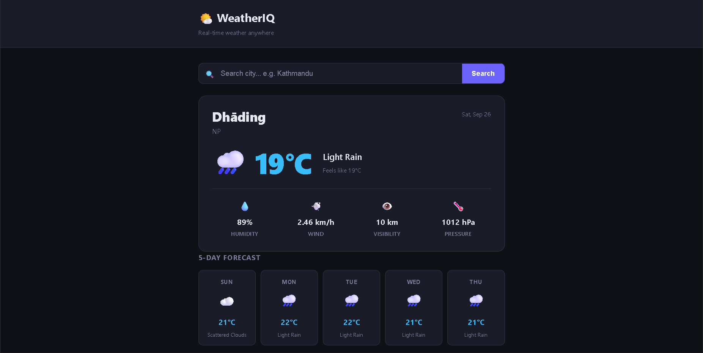

05 — WeatherIQ 🌤️
A real-time weather dashboard built with vanilla JavaScript.Search any city globally, get current weather + 5-day forecast.Built with async/await, AbortController, Debounce, and Layered Architecture.No frameworks. Pure JS.

🎯 What I Built
A modern weather dashboard — search for any city and instantly getcurrent conditions (temp, humidity, wind, visibility, pressure) anda 5-day forecast. Features Google-style auto-complete search thatwaits until you stop typing (Debounce), cancels stale API requestsmid-flight (AbortController), and remembers your last searched cityon refresh. Built with strict Separation of Concerns across 6 distinctlayers.

✨ Features
 Search-as-you-type — auto-fires after user stops typing
 Debounce — 500ms delay to prevent API spam
 AbortController — cancels stale requests if user types fast
 Current weather — temp, feels like, humidity, wind, pressure, visibility
 5-day forecast — filtered from 40 API items using dt_txt.includes("12:00:00")
 Dynamic weather emojis — dictionary object maps API conditions to emojis
 Local storage — saves last searched city, auto-loads on refresh
 HTTP error handling — 404 City Not Found vs Server Error
 Error bubbling — API layer throws, Manager catches, UI renders
 Loading states — spinner shows during fetch, hides on complete
 Toast notifications — success and error popups
 Unix timestamp conversion — API dt converted to human-readable date
 Responsive — grid stacks on mobile, stats adjust dynamically
🧠 JS Concepts Used
Architecture & Design
6-Layer Architecture — DOM Cache, State/Config, Utilities,API Layer, UI Controller, Manager/Event Listeners
Separation of Concerns — API Layer has zero UI logic,UI Layer has zero fetch logic
Error Bubbling — API Layer throws errors without try/catch,letting them bubble up to the Manager's catch block
Async & APIs
async/await — clean syntax for network requests
Promise.all() — fires current weather and forecast fetches concurrently
AbortController — creates signal, passed to fetch, aborts old requests
Debounce (Closure) — setTimeout + clearTimeout inside a closureto delay execution until typing pauses
Fetch API — real network requests to OpenWeatherMap
Core JS
Array methods — find, forEach, filter, some
JSON — parsing API responses and localStorage
Date object — Unix timestamp (seconds) multiplied by 1000 for JS (ms)
String methods — .includes("12:00:00") to filter 5-day forecast
Template literals — dynamic URL construction with query parameters
🏗️ Architecture
```app.js│├── 1. DOM Elements Cache│ └── searchInput, loading, weatherSection, etc.│├── 2. State & Config│ ├── API_BASE, API_KEY (from config.js)│ ├── weatherEmojis (dictionary object)│ └── abortController (for cancelling requests)│├── 3. Utilities│ ├── showToast() ← with timer reset│ └── debounce() ← closure + setTimeout│├── 4. API Layer (The Waiter)│ ├── fetchWeatherData(city, signal) ← throws on !res.ok│ └── fetchWeatherForecast(city, signal) ← throws on !res.ok│├── 5. UI Controller (The Table Setter)│ ├── showLoading()│ ├── hideLoading()│ ├── showError(message)│ ├── renderWeatherData(data) ← wires current weather to DOM│ └── forecastWeather(data) ← loops + filters 5-day cards│├── 6. Manager & Listeners (The Boss)│ ├── getCityWeather(city)│ │ ├── abortController.abort() ← kill old request│ │ ├── new AbortController() ← start new request│ │ ├── Promise.all([...]) ← fetch both APIs at once│ │ ├── renderWeatherData()│ │ └── catch (err) ← AbortError ignored, others shown│ └── searchInput.addEventListener ← debounced input event│├── config.js ← holds API_KEY (gitignored)└── init() ← loads lastCity from localStorage```

🔄 Data Flow
```User types "Tokyo" in search input ↓debounce() waits 500ms after last keystroke ↓getCityWeather("Tokyo") ↓abortController.abort() ← kills "Tok" request if still flyingnew AbortController() ↓Promise.all([ fetchWeatherData("Tokyo", signal), fetchWeatherForecast("Tokyo", signal)]) ↓API Layer throws if !res.ok → Manager catches → showError() ↓hideLoading() ↓renderWeatherData() ← wires temp, wind, etc. to DOMforecastWeather() ← loops list, filters 12:00:00, renders 5 cards ↓localStorage.setItem("lastCity", "Tokyo") ↓DOM reflects new state```

💡 What I Learned
Error Bubbling — if API Layer catches its own errors, it returnsundefined and the app crashes later. Fix: let errors bubble up tothe Manager by removing try/catch in Layer 4
AbortController — passing signal as an argument to fetch functionslets the Manager own the walkie-talkie and cancel requests on demand
Debounce Closures — let timer must be declared outside thereturned function so it remembers the ID across multiple keystrokes
Promise.all() — fires both fetches simultaneously, cutting loadtime in half compared to sequential awaits
5-Day Filtering — OpenWeatherMap returns 40 items (every 3 hours).Using .includes("12:00:00") perfectly grabs 1 mid-day item per day
Unix Timestamps — API returns seconds, JS Date needs milliseconds.Multiply by 1000 before passing to new Date()
AbortError — aborting a fetch throws an error. Must checkerr.name === "AbortError" in catch block to prevent fake error toasts
🚀 How to Run
Get a free API key from OpenWeatherMap
Create config.js in root folder:```jsconst API_KEY = "your_api_key_here";```
Open index.html in browser
No build step — pure HTML CSS JS
📸 Screenshot
WeatherIQ Screenshot


🔗 Live Demo
[View Live]( https://sagar-8848.github.io/javascript-projects/tier-2-asyncNapis/01-weather-dashboard/index.html) ← deploy to GitHub Pages

📁 File Structure
```05-weather-dashboard/ ├── index.html → structure + markup ├── style.css → dark theme + responsive layout ├── config.js → API_KEY (gitignored!) ├── app.js → all JS logic └── README.md → this file```

👨‍💻 Author
Sagar Suwal

GitHub: @sagar-8848
BSc IT — Himalayan College of Management, Nepal
Path: Vanilla JS → React → MERN → GenAI