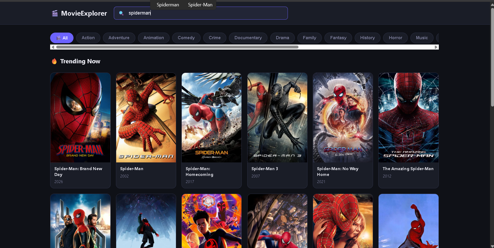

# 06 — MovieExplorer 🎬

> A Netflix-style movie dashboard built with vanilla JavaScript.
>
> Browse trending movies, search in real-time, filter by genre, and view detailed movie information.
>
> Built with async/await, Intersection Observer, AbortController, Debounce, and a 6-layer architecture.
>
> No frameworks. Pure JS.

## 🎯 What I Built

A complete movie browsing experience powered by the **TMDB API**.

Trending movies load automatically when the app starts, with infinite scroll for loading more movies as the user reaches the bottom.

Users can search for movies as they type, filter movies by genre, and click any movie to view detailed information in a modal.

The app also handles real-world API problems using **debouncing, AbortController, error bubbling, loading states, and persistent localStorage state**.

The last search query and selected genre are remembered even after refreshing the page.

## ✨ Features

* [x] Trending movies — loads automatically on page open
* [x] Infinite scroll — IntersectionObserver detects the sentinel
* [x] 3-way browsing state — Trending, Search, and Genre
* [x] Search-as-you-type — 500ms debounce prevents API spam
* [x] AbortController — cancels stale search requests
* [x] Filter by genre — dynamic genre tabs
* [x] Event Delegation — handles dynamically generated genre buttons
* [x] Movie detail modal — backdrop, poster, runtime, genres and overview
* [x] Click outside modal to close
* [x] Skeleton loaders — 12 shimmer cards while loading
* [x] Bottom loading spinner — shown during infinite scroll
* [x] LocalStorage — remembers last search and selected genre
* [x] Toast notifications — displays API and application errors
* [x] Error bubbling — API Layer throws, Manager catches, UI displays
* [x] Responsive — movie grid adapts to smaller screens

## 🧠 JS Concepts Used

### Async & APIs

* **async/await** — clean syntax for handling asynchronous API requests
* **Promise.all()** — loads independent API data concurrently during initialization
* **Fetch API** — communicates with the TMDB REST API
* **Error Bubbling** — API Layer throws errors instead of handling UI concerns, allowing the Manager Layer to catch them

### Performance & Browser APIs

* **Debounce** — closure + setTimeout + clearTimeout delays search until the user stops typing
* **AbortController** — cancels an old request when a newer search begins
* **IntersectionObserver** — watches the sentinel element and triggers the next API request without listening to scroll events
* **Event Delegation** — one listener on the genre container handles clicks on dynamically generated buttons

### Architecture & State

* **6-Layer Architecture** — separates DOM, state/config, utilities, API, UI, and application management
* **Separation of Concerns** — API Layer handles data, UI Layer handles rendering
* **State Object** — keeps query, genre, page, totalPages and loading state in one place
* **3-Way State Management** — the same infinite-scroll logic determines whether the user is browsing Trending, Search, or Genre

## 🏗️ Architecture

```text
app.js
│
├── 1. DOM Elements Cache
│   ├── searchInput
│   ├── genreTabs
│   ├── moviesGrid
│   ├── sentinel
│   ├── modal
│   └── toast
│
├── 2. State & Config
│   ├── apiKey
│   ├── API_BASE
│   ├── IMG_BASE
│   ├── abortController
│   └── state
│       ├── query
│       ├── genre
│       ├── page
│       ├── totalPages
│       └── isLoading
│
├── 3. Utilities
│   ├── debounce()
│   └── showToast()
│
├── 4. API Layer
│   ├── fetchTrending()
│   ├── fetchSearch(query, page, signal)
│   ├── fetchGenres()
│   ├── fetchMovieByGenre(id, page)
│   └── fetchMovieDetails(id)
│
├── 5. UI Controller
│   ├── renderMovies(data, append)
│   ├── renderGenres(data)
│   ├── showSkeletons(count)
│   ├── showModal(movie)
│   └── hideModal()
│
├── 6. Manager & Listeners
│   ├── searchInput "input"
│   │   └── debounce + AbortController
│   │
│   ├── genreTabs "click"
│   │   └── Event Delegation
│   │
│   ├── modalOverlay "click"
│   │   └── click outside to close
│   │
│   ├── modalClose "click"
│   │
│   ├── IntersectionObserver
│   │   └── 3-way pagination logic
│   │
│   └── init()
│       ├── render genres
│       ├── restore LocalStorage state
│       └── load initial movies
```

## 🔄 Data Flow

### Search + Infinite Scroll

```text
User types "Batman"
        ↓
debounce()
        ↓
Wait 500ms after the last keystroke
        ↓
abortController.abort()
        ↓
Cancel previous "Bat" request if still running
        ↓
new AbortController()
        ↓
state.query = "Batman"
state.page = 1
        ↓
localStorage.setItem("lastSearch", "Batman")
        ↓
showSkeletons(12)
        ↓
fetchSearch("Batman", 1, signal)
        ↓
TMDB returns movie data
        ↓
renderMovies(data, false)
        ↓
Skeletons replaced with Batman movies
        ↓
User scrolls to bottom
        ↓
IntersectionObserver detects #sentinel
        ↓
state.page++
        ↓
Show bottom loading spinner
        ↓
if (state.query)
        ↓
fetchSearch("Batman", 2)
        ↓
renderMovies(data, true)
        ↓
Append next movies to existing grid
        ↓
Hide loading spinner
        ↓
DOM reflects new state
```

### 3-Way Infinite Scroll

```text
IntersectionObserver
        ↓
Sentinel becomes visible
        ↓
state.page++
        ↓
Is there a search query?
        │
        ├── YES → fetchSearch(query, page)
        │
        └── NO
              ↓
        Is a genre selected?
              │
              ├── YES → fetchMovieByGenre(genre, page)
              │
              └── NO → fetchTrending(page)
```

## 💡 What I Learned

* **IntersectionObserver is better than scroll events** for infinite scroll because there is no need to calculate scroll position. The sentinel acts like a tripwire at the bottom.

* **AbortController prevents race conditions.** If a user types `Bat` and immediately types `Batman`, the older request might finish later and overwrite the newer results. Aborting the old request prevents that.

* **Debounce is built using a closure.** The timer variable must live outside the returned function so multiple keystrokes can access and reset the same timer.

* **State is essential for pagination.** Without `state.page`, every infinite-scroll request would keep asking the API for Page 1. State acts like a bookmark that remembers where the application currently is.

* **One IntersectionObserver can handle three browsing modes.** The observer checks `state.query`, then `state.genre`, and finally falls back to Trending. This keeps pagination connected to the current application state.

* **Event Delegation works well for dynamic elements.** Genre buttons are created dynamically, so attaching a listener to the parent container allows one listener to handle all current and future buttons.

* **Error bubbling keeps responsibilities separated.** The API Layer should not decide how errors appear in the UI. It throws the error, the Manager handles it, and the UI displays the appropriate message.

* **`renderMovies(data, append)` needs to know the intention.** A new search should replace the existing grid, while infinite scroll should append to it.

* **AbortController is not just about cancelling requests.** It also helps ensure that the UI represents the user's latest intention rather than whichever network request happens to finish last.

* **Separation of Concerns makes the application easier to reason about.** Fetching data, managing state, rendering the UI, and handling user interactions have different responsibilities.

## 🚀 How to Run

1. Get a free API key from TMDB.
2. Create `config.js` in the project root:

```js
const API_KEY = "your_api_key_here";
```

3. Open `index.html` in your browser.
4. No build step required.

> ⚠️ `config.js` contains the API key and should be added to `.gitignore` before pushing the project publicly.

## 📸 Screenshot



## 🔗 Live Demo

[View Live](https://sagar-8848.github.io/javascript-projects/tier-2-foundations/02-movie-explorer/index.html)

## 📁 File Structure

```text
06-movie-explorer/
│
├── index.html
│   → structure + markup
│
├── style.css
│   → dark theme + responsive grid + skeleton shimmer
│
├── config.js
│   → TMDB API key (gitignored)
│
├── app.js
│   → all JavaScript logic
│
└── README.md
   → project documentation
```

## 👨‍💻 Author

**Sagar Suwal**

* GitHub: [@sagar-8848](https://github.com/sagar-8848)
* BSc IT — Himalayan College of Management, Nepal
* Path: Vanilla JS → React → MERN → GenAI
